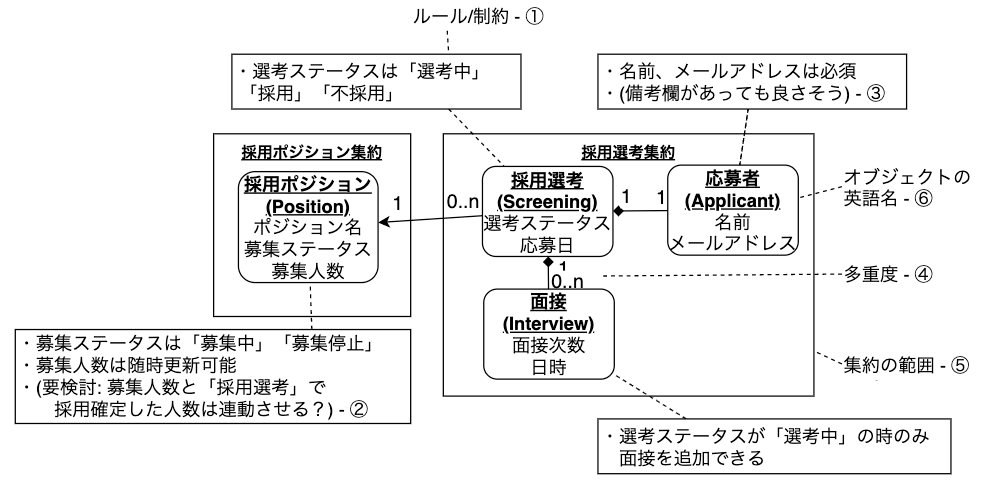

# ドメインモデリングとコードで理解する実践DDD入門

---

## 本日の内容📗

- **DDDとは**
- **なぜDDDなのか**
- **ドメインモデリングとは**
- **ドメインモデリングの結果をどうコードに落とすのか**

---

## 自己紹介

**フロントエンド推進チーム 平野 宇教**

- 24歳(今年でアラサーになることを中村さんにいじられ傷心中)
- IBRの開発をしている。IBRはDDD x オニオンアーキテクチャです。
- 以前は支援開発チームでIBJS, Leaf, smarry, kana, BN, IBRをやっていた。
- DDDなどの設計やアーキテクチャを勉強中、いい加減AIキャッチアップしたい。

---
## DDDとっつきにくくない？

- 専門用語やたら多い
- ハンズオンなどで実際に実装できる教材が少ない
- DDDの雰囲気が分かってもどうやってコードを書いていけばいいかわからない

.....etc

---

今日は、
~~できるだけ専門用語の説明は少なめ~~ or わかりやすく噛み砕いて説明

モデリング & コードを通して

**「DDDおもしろそうじゃね？」**
**「DDDやったらこんないいことがあるんだ！」**

と思える回にしたい！！！！！

---

## このエンジニアゼミを終えたらできるようになること

- **DDDの基礎がわかる**
- **DDDの基本的な用語(エンティティ・値オブジェクト,,,etc)が何かわかる**
- **ドメインモデリングの手法がわかる**
- **ドメインモデル図をもとにしたドメインオブジェクトの実装方法がわかる**

---


## 今回扱わないこと

- **DDDで扱われるアーキテクチャの詳細な内容**
- **ドメイン層以外の実装について**
- **テストについて**
---

<!-- _class: center -->


---

# DDDとは

---

## DDDとは

**ドメイン駆動設計（Domain Driven Design）**

- **ソフトウェア設計手法の1つ**
- **ある領域に存在する特定の問題を解決することにフォーカスした設計手法**

ソフトウェアで問題解決しようとする対象領域のことを**ドメイン**と呼びます。

例: SNS→投稿・フォロー・通知とかのドメイン

---

## DDDのアプローチ

DDDでは問題解決のために以下のアプローチを取ります：

- **ドメインについての理解を深めモデルを継続的に改善する**
- **モデルを継続的にソフトウェアに反映する**

---


---

## モデルって何？
ここでは**ドメインモデル**を指す。

📘 **出典：Eric Evans『Domain-Driven Design』**

*"A model is a system of abstractions that describes selected aspects of a domain and can be used to solve problems related to that domain."*

**モデルとは、ドメインの特定の側面を抽象化したものであり、そのドメインに関する問題を解決するために使われる。**

---

## メモアプリで「抽象化」を考えてみる

ソフトウェアで扱いたい側面だけを切り取る

- 現実のメモ　→　メモの内容、筆跡、文字の大きさ、ペンで書いたのか鉛筆で書いたのか、メモの材質、、、etc

- ソフトウェアのメモ　→　**メモの内容** だけでいい

---

## DDDが向いているソフトウェア

- 複雑なドメインを持つもの

**はまっち曰く6割くらいのソフトウェアはDDDでやれば大体うまくいく、らしい**

---
## DDDが向いていないもの

- 簡単なCRUD処理しかないもの(ただのTodoアプリなど)
- ソフトウェアの価値が技術的な複雑さにあるもの(プログラミング言語、コンパイラ、ストレージなど)

---

## DDDのメリット・デメリット

**メリット**
- 保守性と機能性の向上
- 役に立つソフトウェアを作れる
- コードのドキュメント化

**デメリット**
- 比較的学習コストが高い
- MVCなどに比べ開発初期の開発スピードが劣る
- モデリングをしっかりやると労力がかかる

---

## トランザクションスクリプトとレイヤードアーキテクチャの比較

レイヤ化アーキテクチャ: 開発時間に比例して作成画面数が増えていく。
トランザクションスクリプト: 時間が経つほど作成画面数が減る。


---

# なぜDDDなのか

---

## DDDの目的

ソフトウェアの

- **機能性**
  - ソフトウェアによる問題解決能力
  - ユーザーの要求を満たす力

- **保守性**

を高める。
他にもドメインの知識をドメイン層に記載することでコードのドキュメント化の作用も

---

## DDDでの機能性・保守性向上のためのアプローチ
DDDでは

- ドメインモデルを更新
- 実装パターン

により機能性・保守性を高める。

---
## **モデリングしないと意味がないわけではない!!!**
実装パターンだけを適用したものを**軽量DDDと呼ぶ**

モデリング・実装パターンの両方を取り入れるとより機能性・保守性が高まる。
軽量DDDが批判されることもあるがメリット・デメリットを理解した上での採用なら問題ない！

---

## DDDのサイクル

**モデリング → 実装 → フィードバック → モデリング...**

このサイクルを回すことで：
- **作ったけど使えない**という事態を避けることができる


---

# ドメインモデリングとは

---

## ドメインモデリング

**ドメインモデルを作る作業**

📘 **出典：Eric Evans『Domain-Driven Design』**

*"A model is a system of abstractions that describes selected aspects of a domain and can be used to solve problems related to that domain."*

**モデルとは、ドメインの特定の側面を抽象化したものであり、そのドメインに関する問題を解決するために使われる。**

---

## ドメインモデリングの例

**メモアプリの場合：**

現実のメモには...
- メモの内容
- 筆跡
- 字の大きさ  
- メモの材質

ソフトウェアでは...
- **メモの内容だけ**あれば十分

**必要な側面だけを現実の事象から抽出する**

---

## ドメインモデリングで大事なこと

- **最初から完璧なものを作ろうとしない**
- **モデリング→実装→フィードバック→モデリング**のサイクルを回す
- **実装して初めて気づくこともある**

---


---

## マッチングアプリのモデリングを行う。

sudoモデリングという手法(by ログラス松岡さん)
- システム関連図(system-relation)
- ユースケース図(usecase)
- ドメインモデル図(domain-model)
- オブジェクト図(object)


---

## システム関連図
**開発するシステムと登場人物などの関わりを示した図**

---

## システム関連図サンプル


--- 

## ユースケース図
**ユーザーの要求に対するシステムの振る舞いを定義する図**

---

## ユースケース図サンプル


---

## ドメインモデル図
簡素化したクラス図の様なもの
- オブジェクトの属性を書く
- 制約を吹き出しに書き出す
- オブジェクト同士の関連を示す
- 集約の範囲を定義する


---

## 集約とは
**必ず守りたい強い整合性を持ったオブジェクトのまとまり**

---

## ドメインモデル図サンプル


---

## オブジェクト図
**ドメインモデルの具体例を示した図**

---


---
今回は

- システム関連図(system-relation)
- ユースケース図(usecase)
- ドメインモデル図(domain-model)
- ~~オブジェクト図(object)~~

3つの図で行います!

---

## ドメインエキスパート

**そのドメインに詳しい人**

例：
- 経費精算システム → 経理部の人
- マッチングアプリ → 今回はChatGPTを活用

---


## ドメインモデリングの結果をコードに落とす

---

## 言語

**言語：Ruby/Rails**
- IBJのエンジニアが最もとっつきやすいであろう
- ただし、DDDには向かない言語
- 本格的にはJavaやGoなどの静的言語が向いている

---

## アーキテクチャ

**オニオンアーキテクチャ🧅**

**4つの層に役割を分ける：**
- ドメイン層
- インフラ層  
- ユースケース層
- プレゼンテーション層

**ドメイン層はどこにも依存しない**

---


---


---

## 完全コンストラクタパターン

**ドメインオブジェクトの実装に使用**

- インスタンス化する際に初期化されていない値の代入を防ぐ
- インスタンス化した時点でオブジェクトが完全な状態
- setterは用意せず、特別なミューテーションメソッドを用意

---
## 完全コンストラクタパターンを用いない例

```ruby
class User
  attr_accessor :name, :email, :age
  
  def initialize
    # 引数なしで初期化、不完全な状態
  end
end

# 不完全な状態でインスタンス化
user = User.new

# 後からsetterで値を設定（外部から自由に変更可能）
user.name = "田中太郎"
user.email = "tanaka@example.com"
user.age = 25

# 外部から自由に値を変更できてしまう
user.age = -100  # 不正な値も入ってしまう
```

---

## エンティティとは

**同一判定を識別子で行うもの**

例：人間
- 名前、生年月日、顔が同じでも別人として扱われる
- 現実では戸籍やDNAで判定

エンティティでは **識別子（ID）** で判定
一意であることを示したいので **UUID** が一般的な気がします

---

## 値オブジェクトとは

**同一判定を保持する値で行うもの**

例：お金
- 10円玉を2つ持っている際、その10円玉は同じ10円
- 持っている属性が同じなら同一のものとみなせる

---

## ディレクトリ構成

```
app/
├── controllers/     # プレゼンテーション層
├── domain/          # ドメイン層
│   └── models/      # ドメインオブジェクト
├── infra/           # インフラ層
└── usecase/         # ユースケース層
```

---

## ドメインモデル図をもとにして再現する

---

## 参考資料・引用元・など
- https://www.domainlanguage.com/ddd/
- https://little-hands.hatenablog.com/entry/2018/12/10/ddd-architecture
- https://little-hands.hatenablog.com/entry/2018/10/08/goal-of-ddd
- https://little-hands.hatenablog.com/entry/2022/06/01/ddd-modeling


---

## GitHub リポジトリ
https://github.com/TakayukiHirano117/rails-matching-app-sample-ddd


---

# ご清聴ありがとうございました！